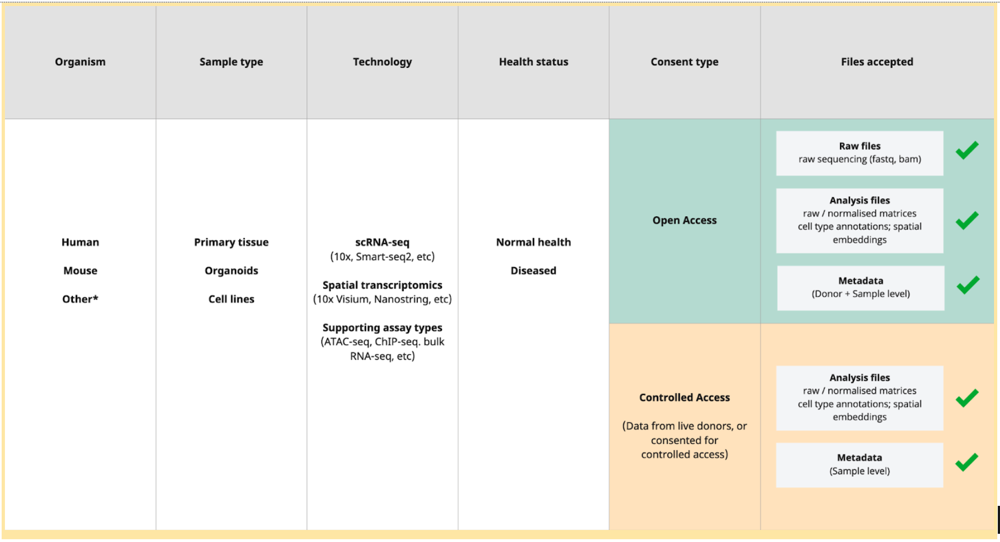

# Data Suitability
The Human Cell Atlas Data Coordination Platform supports scientists in their atlas-building efforts by providing easy access to cellular-resolution data generated by the research community.

Data considered for inclusion in the HCA Data Coordination Platform should meet at least one option per category below:

* **Organism:** Human, Mouse, Other*
* **Sample type:** Primary tissue, Organoids, Cell lines
* **Technology:**
    * scRNA-seq (10x, Smart-seq2, etc)
    * Spatial transcriptomics (10x Visium, Nanostring, etc)
    * Other supporting assay types (ATAC-seq, ChIP-seq. bulk RNA-seq, etc)
* **Health status:** Normal health, diseased
* **Data consent type:** Open access, Controlled access
* **Publication status:** Pre-print, Published, Not published

Please [contact us](mailto:wrangler-team@data.humancellatlas.org?subject=Non%20Human%20Contribution%20to%20Human%20Cell%20Atlas) if you are considering contributing data from species other than Human and Mouse, or you wish to discuss our suitability criteria.

# Data consent type: Open or Controlled access

Depending on the data consent documents supporting the study and the respective data, datasets eligible for the Human Cell Atlas would either be

* **Open access** (where the raw data is consented for open access by the scientific community and can be made publicly, e.g. in a public archive)
or
* **Controlled access** (where the raw data is consented for controlled, or managed access. This type of access usually has to be granted by a nominated DAC (Data Access Committee)

The Human Cell Atlas Data Coordination Platform accepts datasets featuring both consent types, with an important note on the data and metadata files required for each type:

## Open access accepted data and metadata:

Raw sequencing files (fastq, bam)

Donor and sample metadata

Analysis files (raw/normalised matrices; cell type annotations; spatial embeddings)

## Controlled access accepted data and metadata:

Sample metadata (no donor-identifiable metadata)

Analysis files (raw/normalised matrices; cell type annotations; spatial embeddings)

# Data sources and eligibility

There are three main sources of data considered eligible for the Human Cell Atlas:

## Data referenced for the Human Cell Atlas Bionetwork Atlases

The data is referenced by the HCA Bionetwork scientific groups as suitable for integration into one of the HCA Bionetwork atlases.

## Data directly contributed to the HCA Data Coordination Platform

There is a pre-print or official publication referencing data that meets the criteria for published data (see suitability criteria above), or a supporting justification as to why it should be included in the HCA.
The data owner contributes the data to the Human Cell Atlas Data Coordination Platform, with support of the HCA DCP data wranglers.

## Data from official Human Cell Atlas publications

The data is referenced in a publication reviewed by the HCA publication committee and is added to the official HCA publications list.

# Data contribution checklist

To contribute data to the Human Cell Atlas Data Coordination Platform, follow this checklist:

1. Make sure your dataset conforms to the suitability criteria
2. Get informed about the consent type for your dataset (Open access, Controlled access, or a mix of both)
3. Prepare the data and metadata for your dataset, based on the requirements for your data consent type
4. Fill in the questionnaire
5. Contact HCA Data Coordination Platform [data wrangling team](mailto:wrangler-team@data.humancellatlas.org?subject=get%20started%20with%20data%20contribution) to get you started 

